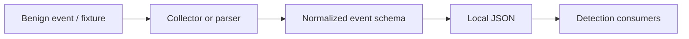

# 03 — Telemetry Sensor Framework

<p align="center">
   
</p>

> **Portfolio role:** EDR/XDR-style telemetry engineering proof

## Overview

A userland telemetry framework for normalizing endpoint events into explicit, testable data structures that later detection and response projects can consume.

This project is part of the **Cybersecurity Engineering Portfolio** monorepo and the broader **Project MadHatter** roadmap. This README is written as a standalone project introduction: what exists now, what is being built next, how progress is validated, and where the project deliberately stops.

## Current State

| Field | Current value |
|---|---|
| **Status** | Scaffold |
| **Primary stack** | Rust |
| **Portfolio role** | EDR/XDR-style telemetry engineering proof |
| **Validation entry point** | `cargo test` |
| **Next milestone** | Strengthen the normalized event schema and safe local JSON output, including timestamps, source, event type, required fields, missing values, and serialization behavior. |

Rust supports the current telemetry prototype and event normalization work. The project remains a scaffold rather than a production EDR/XDR agent.

> **Maturity note:** project names describe the intended engineering direction. A scaffold, fixture validator, or design artifact is not presented as a deployed production capability.

## Engineering Direction



### Current Development Target

Strengthen the normalized event schema and safe local JSON output, including timestamps, source, event type, required fields, missing values, and serialization behavior.

### Learning Focus

Rust ownership, Tokio, Windows Event Log/ETW concepts, Linux /proc, event schemas, OpenTelemetry.

## Validation

Primary baseline entry point:

```bash
cargo test
```

The command above is a **validation entry point**, not a blanket claim that every environment, integration, or future feature currently passes. Record the revision, operating system, relevant tool versions, inputs, expected behavior, actual behavior, and limitations when capturing results.

## Scope & Safety

Begin in userland with owned systems and benign fixtures. Avoid kernel-risky implementation until privileges, recovery, performance, and failure behavior are understood.

Work for this project is limited to owned systems and VMs, synthetic data and toy targets, designated CTF/HTB environments where the rules permit the activity, or systems covered by explicit written authorization.

No project README should turn an intended feature into a claim of demonstrated behavior without evidence.

## Portfolio Integration

Provides the telemetry foundation for detection engineering, SIEM queries, DFIR workflows, and later response logic.

See the repository-level [`README.md`](../README.md) for the full project map and [`ProjectMadHatter`](../ProjectMadHatter/) for the execution roadmap.

## Documentation & Evidence Standard

This project should maintain, as applicable:

- a recruiter-readable README;
- a charter with purpose, scope, non-goals, allowed environment, success criteria, and stop conditions;
- design and source-map documentation;
- reproducible validation notes;
- sanitized evidence that directly supports public claims;
- explicit limitations and lessons learned.

Raw evidence, local backups, build output, secrets, and machine-specific artifacts should remain excluded according to the repository and project `.gitignore` rules.

## Status Language

- **Planned** — scope/design exists; behavior is not demonstrated.
- **Scaffold** — files and a minimal prototype exist; broader capability is unfinished.
- **Validated scaffold** — specific checks passed on a recorded revision/environment.
- **Portfolio ready** — demonstrable artifact, reproducible checks, clear docs, safe evidence, honest limitations.
- **Completed milestone** — defined acceptance criteria were met; maintenance or later enhancements may remain.

---

<p align="center"><sub>Part of the Cybersecurity Engineering Portfolio • Project MadHatter</sub></p>
