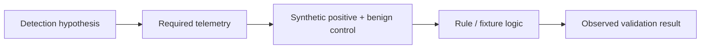

# 04 — Detection Engineering Lab

<p align="center">
   
</p>

> **Portfolio role:** Blue-team validation environment

## Overview

A reproducible detection-engineering lab centered on synthetic events, detection fixtures, false-positive analysis, and evidence-backed validation.

This project is part of the **Cybersecurity Engineering Portfolio** monorepo and the broader **Project MadHatter** roadmap. This README is written as a standalone project introduction: what exists now, what is being built next, how progress is validated, and where the project deliberately stops.

## Current State

| Field | Current value |
|---|---|
| **Status** | Scaffold |
| **Primary stack** | Python + YAML |
| **Portfolio role** | Blue-team validation environment |
| **Validation entry point** | `python3 pipelines/validate_detections.py` |
| **Next milestone** | Add one synthetic process event and one detection test with a documented benign near-match or false-positive case. |

The current Python/YAML scaffold validates synthetic events and detection fixtures. Terraform and fuller lab deployment remain future directions.

> **Maturity note:** project names describe the intended engineering direction. A scaffold, fixture validator, or design artifact is not presented as a deployed production capability.

## Engineering Direction



### Current Development Target

Add one synthetic process event and one detection test with a documented benign near-match or false-positive case.

### Learning Focus

Sigma, Suricata, Zeek, KQL, telemetry requirements, ATT&CK mapping, false-positive tuning.

## Validation

Primary baseline entry point:

```bash
python3 pipelines/validate_detections.py
```

The command above is a **validation entry point**, not a blanket claim that every environment, integration, or future feature currently passes. Record the revision, operating system, relevant tool versions, inputs, expected behavior, actual behavior, and limitations when capturing results.

## Scope & Safety

Use synthetic data, owned labs, or intentionally vulnerable environments. Fixture matching must not be presented as native-engine detection effectiveness unless that engine was actually exercised.

Work for this project is limited to owned systems and VMs, synthetic data and toy targets, designated CTF/HTB environments where the rules permit the activity, or systems covered by explicit written authorization.

No project README should turn an intended feature into a claim of demonstrated behavior without evidence.

## Portfolio Integration

Consumes telemetry from Project 03 and produces validated observations that support Projects 15, 06, 14, and 17.

See the repository-level [`README.md`](../README.md) for the full project map and [`ProjectMadHatter`](../ProjectMadHatter/) for the execution roadmap.

## Documentation & Evidence Standard

This project should maintain, as applicable:

- a recruiter-readable README;
- a charter with purpose, scope, non-goals, allowed environment, success criteria, and stop conditions;
- design and source-map documentation;
- reproducible validation notes;
- sanitized evidence that directly supports public claims;
- explicit limitations and lessons learned.

Raw evidence, local backups, build output, secrets, and machine-specific artifacts should remain excluded according to the repository and project `.gitignore` rules.

## Status Language

- **Planned** — scope/design exists; behavior is not demonstrated.
- **Scaffold** — files and a minimal prototype exist; broader capability is unfinished.
- **Validated scaffold** — specific checks passed on a recorded revision/environment.
- **Portfolio ready** — demonstrable artifact, reproducible checks, clear docs, safe evidence, honest limitations.
- **Completed milestone** — defined acceptance criteria were met; maintenance or later enhancements may remain.

---

<p align="center"><sub>Part of the Cybersecurity Engineering Portfolio • Project MadHatter</sub></p>
