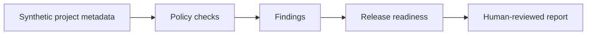

# 08 — Secure Software Supply Chain Lab

<p align="center">
   
</p>

> **Portfolio role:** AppSec / DevSecOps proof

## Overview

A secure-delivery lab for practicing supply-chain validation, release-readiness checks, secret-like finding controls, and future SBOM/signing workflows.

This project is part of the **Cybersecurity Engineering Portfolio** monorepo and the broader **Project MadHatter** roadmap. This README is written as a standalone project introduction: what exists now, what is being built next, how progress is validated, and where the project deliberately stops.

## Current State

| Field | Current value |
|---|---|
| **Status** | Scaffold |
| **Primary stack** | Python; Bash/GitHub Actions later |
| **Portfolio role** | AppSec / DevSecOps proof |
| **Validation entry point** | `python3 pipelines/validate_supply_chain.py` |
| **Next milestone** | Generate a Markdown report from validation JSON while preserving findings and release-readiness status without overstating what was scanned. |

The current Python baseline validates synthetic supply-chain data and secret-like findings. Real scanner, signing, and CI integrations are later work.

> **Maturity note:** project names describe the intended engineering direction. A scaffold, fixture validator, or design artifact is not presented as a deployed production capability.

## Engineering Direction



### Current Development Target

Generate a Markdown report from validation JSON while preserving findings and release-readiness status without overstating what was scanned.

### Learning Focus

NIST SSDF, SLSA, CycloneDX, SPDX, OpenSSF Scorecard, Gitleaks, Syft, Grype, OSV, Trivy concepts.

## Validation

Primary baseline entry point:

```bash
python3 pipelines/validate_supply_chain.py
```

The command above is a **validation entry point**, not a blanket claim that every environment, integration, or future feature currently passes. Record the revision, operating system, relevant tool versions, inputs, expected behavior, actual behavior, and limitations when capturing results.

## Scope & Safety

Use owned repositories or toy projects. Never treat synthetic findings as proof that real dependency scanning or signing has occurred.

Work for this project is limited to owned systems and VMs, synthetic data and toy targets, designated CTF/HTB environments where the rules permit the activity, or systems covered by explicit written authorization.

No project README should turn an intended feature into a claim of demonstrated behavior without evidence.

## Portfolio Integration

Supports the portfolio secure-build discipline and feeds release evidence into the broader engineering workflow.

See the repository-level [`README.md`](../README.md) for the full project map and [`ProjectMadHatter`](../ProjectMadHatter/) for the execution roadmap.

## Documentation & Evidence Standard

This project should maintain, as applicable:

- a recruiter-readable README;
- a charter with purpose, scope, non-goals, allowed environment, success criteria, and stop conditions;
- design and source-map documentation;
- reproducible validation notes;
- sanitized evidence that directly supports public claims;
- explicit limitations and lessons learned.

Raw evidence, local backups, build output, secrets, and machine-specific artifacts should remain excluded according to the repository and project `.gitignore` rules.

## Status Language

- **Planned** — scope/design exists; behavior is not demonstrated.
- **Scaffold** — files and a minimal prototype exist; broader capability is unfinished.
- **Validated scaffold** — specific checks passed on a recorded revision/environment.
- **Portfolio ready** — demonstrable artifact, reproducible checks, clear docs, safe evidence, honest limitations.
- **Completed milestone** — defined acceptance criteria were met; maintenance or later enhancements may remain.

---

<p align="center"><sub>Part of the Cybersecurity Engineering Portfolio • Project MadHatter</sub></p>
