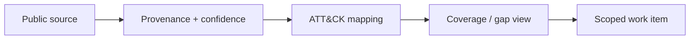

# 12 — Threat Intelligence Fusion & ATT&CK Navigator

<p align="center">
   
</p>

> **Portfolio role:** Threat intelligence engineering

## Overview

A public-source intelligence workflow for preserving provenance, mapping observations to ATT&CK, identifying detection gaps, and preparing Navigator-compatible output.

This project is part of the **Cybersecurity Engineering Portfolio** monorepo and the broader **Project MadHatter** roadmap. This README is written as a standalone project introduction: what exists now, what is being built next, how progress is validated, and where the project deliberately stops.

## Current State

| Field | Current value |
|---|---|
| **Status** | Scaffold |
| **Primary stack** | Python + JSON + ATT&CK |
| **Portfolio role** | Threat intelligence engineering |
| **Validation entry point** | `python3 pipelines/fuse_intel.py` |
| **Next milestone** | Add source-reliability notes and a Navigator-layer README, then validate output against the relevant Navigator format. |

Python and JSON support public-source mapping and future Navigator export. Source quality and analytical interpretation remain explicit concerns.

> **Maturity note:** project names describe the intended engineering direction. A scaffold, fixture validator, or design artifact is not presented as a deployed production capability.

## Engineering Direction



### Current Development Target

Add source-reliability notes and a Navigator-layer README, then validate output against the relevant Navigator format.

### Learning Focus

ATT&CK Navigator, STIX/TAXII, MISP concepts, public advisories, confidence, source evaluation, detection gaps.

## Validation

Primary baseline entry point:

```bash
python3 pipelines/fuse_intel.py
```

The command above is a **validation entry point**, not a blanket claim that every environment, integration, or future feature currently passes. Record the revision, operating system, relevant tool versions, inputs, expected behavior, actual behavior, and limitations when capturing results.

## Scope & Safety

Use public sources and carefully preserve provenance. Technique counts or coverage maps do not prove detections work.

Work for this project is limited to owned systems and VMs, synthetic data and toy targets, designated CTF/HTB environments where the rules permit the activity, or systems covered by explicit written authorization.

No project README should turn an intended feature into a claim of demonstrated behavior without evidence.

## Portfolio Integration

Supplies threat context and provenance to Project 02 and the SIEM/query library once contracts are defined.

See the repository-level [`README.md`](../README.md) for the full project map and [`ProjectMadHatter`](../ProjectMadHatter/) for the execution roadmap.

## Documentation & Evidence Standard

This project should maintain, as applicable:

- a recruiter-readable README;
- a charter with purpose, scope, non-goals, allowed environment, success criteria, and stop conditions;
- design and source-map documentation;
- reproducible validation notes;
- sanitized evidence that directly supports public claims;
- explicit limitations and lessons learned.

Raw evidence, local backups, build output, secrets, and machine-specific artifacts should remain excluded according to the repository and project `.gitignore` rules.

## Status Language

- **Planned** — scope/design exists; behavior is not demonstrated.
- **Scaffold** — files and a minimal prototype exist; broader capability is unfinished.
- **Validated scaffold** — specific checks passed on a recorded revision/environment.
- **Portfolio ready** — demonstrable artifact, reproducible checks, clear docs, safe evidence, honest limitations.
- **Completed milestone** — defined acceptance criteria were met; maintenance or later enhancements may remain.

---

<p align="center"><sub>Part of the Cybersecurity Engineering Portfolio • Project MadHatter</sub></p>
