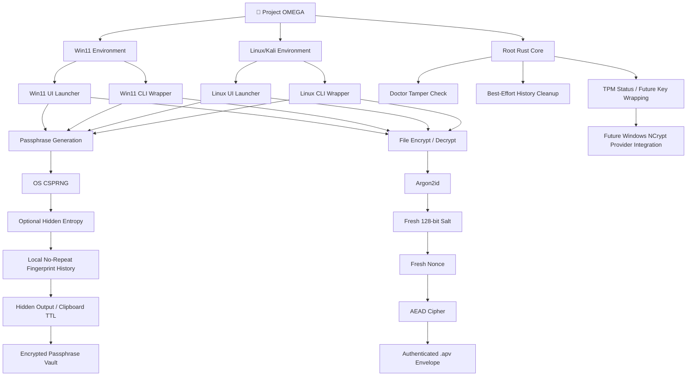

# Project OMEGA / AegisPhrase

<!-- PORTFOLIO-PUBLIC-STATUS -->
> **Public portfolio status:** Project OMEGA is an existing applied-learning implementation. The public tree includes the Rust application plus Linux/Windows documentation and helper scripts. Environment-specific secrets and build artifacts are excluded. Validate the current Rust baseline with `cargo check`.


Project OMEGA is a local-first Rust utility for defensive passphrase generation, authenticated `.apv` encryption envelopes, command-line workflows, and interactive terminal UI workflows on Windows 11 and Linux/Kali.

The project is designed for personal security, portfolio demonstration, and controlled validation. It is not a replacement for a full password manager, hardware security module, endpoint protection suite, or independent cryptographic audit.

## Status

Final validation has been completed for both supported environments:

| Area | Windows 11 | Linux/Kali |
|---|---:|---:|
| Format/build/release | PASS | PASS |
| Smoke tests | PASS | PASS |
| CLI vault encrypt/decrypt | PASS | PASS |
| CLI file encrypt/decrypt round-trip | PASS | PASS |
| UI vault workflow | PASS | PASS |
| UI file encrypt/decrypt round-trip | PASS | PASS |
| Wrong-password fail-closed behavior | PASS | PASS |
| Metadata tamper rejection | PASS | PASS |
| Ciphertext tamper rejection | PASS | PASS |
| Controlled crack-resistance validation | PASS | PASS |

Project OMEGA should be described as **crack-resistant under tested offline dictionary conditions**, not “uncrackable.” A weak encryption password, compromised endpoint, keylogger, clipboard logger, or larger attack budget can still defeat user choices or endpoint assumptions.

## Clean repository layout

```text
Project_OMEGA/
├── Cargo.toml
├── Cargo.lock
├── LICENSE-MIT
├── README.md
├── src/
│   └── main.rs
├── docs/
│   ├── ThreatModel.md
│   ├── SecurityAudit.md
│   └── Full_CLI_UI_Guide.md
├── Win11/
│   ├── README_WIN11.md
│   └── scripts/
│       ├── win11_cli.ps1
│       ├── win11_ui.ps1
│       └── windows_test.ps1
└── Linux/
    ├── README_LINUX_KALI.md
    └── scripts/
        ├── linux_cli.sh
        ├── linux_ui.sh
        └── linux_kali_test.sh
```

The Rust core remains in the project root because Cargo expects `Cargo.toml` and `src/` there. Platform-specific launchers and instructions are isolated under `Win11/` and `Linux/`.

## Core capabilities

- Generate 30–64 character passphrases.
- Use OS-backed cryptographic randomness.
- Mix optional hidden user entropy into generation state.
- Track local SHA-256 fingerprints to block local repeats while history exists.
- Hide generated or decrypted secrets from terminal output.
- Copy secrets to clipboard with time-based clearing.
- Save generated passphrases into encrypted `.apv` vault envelopes.
- Encrypt and decrypt arbitrary files through authenticated `.apv` envelopes.
- Verify executable integrity with `doctor` SHA-256 checks.
- Provide Windows TPM status detection and documented future TPM key-wrapping direction.
- Provide best-effort shell history cleanup.

## Security design summary

Encrypted `.apv` envelopes use:

- Argon2id key derivation.
- Fresh random 128-bit salt per envelope.
- Fresh random nonce per envelope.
- AEAD encryption through AES-256-GCM, XChaCha20-Poly1305, or AES-256-GCM-SIV.
- Versioned JSON metadata containing cipher/KDF parameters, salt, nonce, and ciphertext.
- No plaintext source filename stored inside the encrypted envelope.

The default cipher is AES-256-GCM. XChaCha20-Poly1305 and AES-256-GCM-SIV are available as alternate authenticated encryption modes.

## Platform launch points

### Windows 11

From the project root:

```powershell
Set-ExecutionPolicy -Scope Process -ExecutionPolicy Bypass
.\Win11\scripts\win11_ui.ps1
```

CLI wrapper:

```powershell
Set-ExecutionPolicy -Scope Process -ExecutionPolicy Bypass
.\Win11\scripts\win11_cli.ps1 --help
```

### Linux/Kali

From the project root:

```bash
chmod +x Linux/scripts/*.sh
./Linux/scripts/linux_ui.sh
```

CLI wrapper:

```bash
chmod +x Linux/scripts/*.sh
./Linux/scripts/linux_cli.sh --help
```

## Build commands

```bash
cargo fmt --check
cargo check
cargo build --release
```

## Dolphin flowchart



## Monorepo housekeeping

Before pushing to GitHub, ensure the repository does not contain:

```text
target/
*.apv
*.recovered.txt
*sample*.txt
*final*.txt
*tampered*
omega_crack_attempt.sh
omega-crack-test-wordlist.txt
crack-attempt-output.tmp
logs/
tmp/
```

Then run:

```bash
git status
```

## Limitations

No local-only generator can honestly guarantee global never-repeat across every machine forever without shared persistent state. Project OMEGA enforces local no-repeat while the local fingerprint history remains intact.

Terminal cleanup and clipboard clearing are best-effort. They cannot erase screenshots, terminal transcripts, clipboard managers, malware logs, EDR/AV telemetry, keyloggers, swap/pagefile captures, or secrets pasted into other applications.
