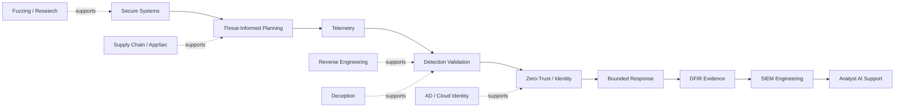

<div align="center">

# 🛡️ Cybersecurity Engineering Portfolio

### Secure systems • Threat-informed defense • Telemetry • Detection • DFIR • Identity • AI


**Entr0pyArchitect**

</div>

---

## About This Portfolio

This repository is my long-term **cybersecurity engineering portfolio**: a single monorepo built to show how I design, test, document, validate, and connect security systems across multiple disciplines.

The objective is not to collect disconnected tools. The objective is to build a coherent body of work where every serious claim is tied to code, documentation, validation, evidence, or a clearly labeled limitation.

The portfolio spans secure systems and cryptographic engineering, threat-informed defense, endpoint telemetry, detection engineering, zero-trust infrastructure, cloud identity, incident response, DFIR, SIEM, deception, reverse engineering, vulnerability research, software supply chains, and bounded AI-assisted security workflows.

The portfolio is managed through **[Project MadHatter](ProjectMadHatter/)** using the doctrine:

> **Build → Learn → Practice → Document → Prove**

## Portfolio at a Glance

| Area | Current direction |
|---|---|
| **Repository model** | One root Git history / monorepo |
| **Project 01** | **TripplePulsarVault — completed anchor project** |
| **Current implementation lane** | Project 02 — Threat-Informed Defense Platform |
| **Projects 02–17** | Development projects/scaffolds at different maturity levels |
| **Project 18** | Private security research capstone; implementation intentionally excluded from the public repository |
| **Roadmap** | Project MadHatter |
| **Evidence model** | Claims backed by reproducible tests, notes, diagrams, logs, screenshots, or decision records |
| **Scope** | Owned systems, synthetic data, designated labs/CTFs, or explicit written authorization |

## Engineering Story



## Featured Completed Project

### 🌌 [01 — TripplePulsarVault](01-TripplePulsarVault/)

**TripplePulsarVault is finished.**

It is the completed anchor of the portfolio: a Windows-oriented cryptographic file vault written in Rust with TPF2/TPF3 container support, Argon2id/HKDF key derivation, authenticated encryption, TPM-backed wrapping, ML-KEM-768 key wrapping, memory-hygiene measures, and extensive supporting documentation.

Its role in this portfolio is to establish the standard the remaining projects are working toward: a serious artifact with architecture, implementation, threat modeling, validation, limitations, and recruiter-readable documentation.

## Project Directory

| Project | Focus | Stack | Current state |
|---|---|---|---|
| [01 — TripplePulsarVault](01-TripplePulsarVault/) | Secure systems / cryptographic vault engineering | Rust | **Completed** |
| [02 — Threat-Informed Defense Platform](02-Threat-Informed-Defense-Platform/) | Purple-team orchestration / ATT&CK mapping | Go; Python planned for supporting tooling | Active Build Lane |
| [03 — Telemetry Sensor Framework](03-Telemetry-Sensor-Framework/) | EDR/XDR-style telemetry engineering proof | Rust | Scaffold |
| [04 — Detection Engineering Lab](04-Detection-Engineering-Lab/) | Blue-team validation environment | Python + YAML | Scaffold |
| [05 — Zero-Trust Micro-Infrastructure](05-Zero-Trust-Micro-Infrastructure/) | Infrastructure security / zero trust | Python + Terraform/Kubernetes later | Scaffold |
| [06 — Autonomous Response Module](06-Autonomous-Response-Module/) | Bounded response automation | Go + JSON playbooks | Scaffold |
| [07 — AI Ethical Hacking Agent](07-AI-Ethical-Hacking-Agent/) | Bounded human-in-the-loop security assistant | Python; TypeScript/UI later | Scaffold |
| [08 — Secure Software Supply Chain Lab](08-Secure-Software-Supply-Chain-Lab/) | AppSec / DevSecOps proof | Python; Bash/GitHub Actions later | Scaffold |
| [09 — Cloud Identity Attack Path Defense Lab](09-Cloud-Identity-Attack-Path-Defense-Lab/) | Cloud identity risk modeling | Python; Terraform/KQL later | Scaffold |
| [10 — Malware Analysis & Reverse Engineering Workbench](10-Malware-Analysis-Reverse-Engineering-Workbench/) | Static triage / reverse-engineering learning | Python; C/C++ and analysis-tool integrations planned | Scaffold |
| [11 — Active Directory Purple Team Range](11-Active-Directory-Purple-Team-Range/) | AD defense / identity detection | Python now; PowerShell + Terraform/Ansible later | Scaffold |
| [12 — Threat Intelligence Fusion & ATT&CK Navigator](12-Threat-Intelligence-Fusion-ATTACK-Navigator/) | Threat intelligence engineering | Python + JSON + ATT&CK | Scaffold |
| [13 — Vulnerability Research & Fuzzing Lab](13-Vulnerability-Research-Fuzzing-Lab/) | Toy fuzzing / parser validation | Python now; Rust/C/C++ later | Scaffold |
| [14 — DFIR Evidence Automation Toolkit](14-DFIR-Evidence-Automation-Toolkit/) | Evidence hashing and DFIR workflow | Python now; PowerShell/Bash later | Scaffold |
| [15 — SIEM Engineering Query Library](15-SIEM-Engineering-Query-Library/) | Detection metadata / query engineering | Python + KQL + SPL + Sigma | Scaffold |
| [16 — Deception & Honeypot Research Grid](16-Deception-Honeypot-Research-Grid/) | Synthetic deception telemetry | Python now; Docker/Cowrie/Zeek/Suricata later | Scaffold |
| [17 — AI-Enhanced SOC Copilot & RAG Knowledge Base](17-AI-Enhanced-SOC-Copilot-RAG-Knowledge-Base/) | Local SOC knowledge retrieval foundation | Python; RAG/vector stack later | Scaffold |
| **18 — Private Security Research Capstone** | Implementation and planning material intentionally excluded from public Git history | Private | Local Only |

## Applied Learning Tracks

[`Other/`](Other/) contains deeper applied-learning work that sits outside the numbered core sequence.

- **[Blue Team](Other/BlueTeam/)** — defensive and secure-systems projects used to apply concepts in larger, more integrated environments. Current material includes the cybersecurity capstone, FortKnox, and Project OMEGA.
- **[Red Team](Other/RedTeam/)** — future offensive-security applied learning for isolated labs, CTFs, owned systems, and explicitly authorized testing. Public Git currently contains planning and governance documentation only; implementations remain local until each environment passes scope, safety, cleanup, and publication review.

Any future malware research remains confined to isolated virtualized lab environments. Runnable malware artifacts, live payloads, credentials, and operational target information are not intended for the public portfolio.

## Project MadHatter

[`ProjectMadHatter/`](ProjectMadHatter/) is the roadmap, documentation, and execution layer for the portfolio. It defines one primary implementation lane at a time, project sequencing, independent technical authorship, learning/CTF integration, evidence discipline, review gates, and authorized-environment boundaries.

### Public documentation

- [Project MadHatter public documentation](ProjectMadHatter/Documentation/README.md)

Detailed planning manuals are maintained locally and intentionally excluded from public Git history.

## Repository Layout

```text
Cybersecurity-Engineering-Portfolio/
├── 01-TripplePulsarVault/
├── 02-Threat-Informed-Defense-Platform/
├── 03-Telemetry-Sensor-Framework/
├── 04-Detection-Engineering-Lab/
├── 05-Zero-Trust-Micro-Infrastructure/
├── 06-Autonomous-Response-Module/
├── 07-AI-Ethical-Hacking-Agent/
├── 08-Secure-Software-Supply-Chain-Lab/
├── 09-Cloud-Identity-Attack-Path-Defense-Lab/
├── 10-Malware-Analysis-Reverse-Engineering-Workbench/
├── 11-Active-Directory-Purple-Team-Range/
├── 12-Threat-Intelligence-Fusion-ATTACK-Navigator/
├── 13-Vulnerability-Research-Fuzzing-Lab/
├── 14-DFIR-Evidence-Automation-Toolkit/
├── 15-SIEM-Engineering-Query-Library/
├── 16-Deception-Honeypot-Research-Grid/
├── 17-AI-Enhanced-SOC-Copilot-RAG-Knowledge-Base/
├── Other/
├── ProjectMadHatter/
├── CTF_Writeups/
├── Shared/
├── .gitignore
└── README.md
```

## Public / Private Boundary

This repository contains the **public portfolio surface** only. Sensitive planning material, raw evidence, credentials, local environment details, and the implementation of private research projects are intentionally maintained outside public Git history.

The public repository is designed to demonstrate engineering decisions, reproducible validation, and professional documentation without publishing operational material that does not need to be public.

## Evidence Standard

A project becomes credible when the README clearly separates **what is planned** from **what has actually been demonstrated**.

| Artifact | What it should prove |
|---|---|
| **README + runnable example** | Purpose, setup, use, demonstrated behavior, and limitations |
| **Architecture / threat model** | Data flow, assumptions, trust boundaries, abuse cases, and controls |
| **Validation record** | Inputs, checks, outputs, failures, environment, and reproduction steps |
| **Source map** | Which references support each technical or design claim |
| **Scope statement** | Allowed targets, prohibited actions, data handling, and stop conditions |
| **Lessons learned** | What changed, what was proved, and what remains unknown |

## Maturity Language

- **Planned** — scope or design exists; behavior is not yet demonstrated.
- **Scaffold** — files and a minimal prototype exist; broader capability remains unfinished.
- **Validated scaffold** — specific checks passed on a recorded revision and environment.
- **Portfolio ready** — demonstrable artifact, reproducible checks, clear documentation, safe evidence, and honest limitations.
- **Completed milestone** — defined acceptance criteria were met; maintenance or later enhancements may remain.

## Engineering Principles

1. **Evidence before claims.**
2. **One main build lane at a time.**
3. **Official and primary sources first.**
4. **Small, testable changes over uncontrolled scope growth.**
5. **Security boundaries are part of the design, not an afterthought.**
6. **Failure notes are evidence when they explain what happened and why.**
7. **Public documentation must be safe, reproducible, and honest about limitations.**

## Legal & Ethical Scope

Work in this portfolio is limited to systems and networks I own, local VMs and isolated labs, synthetic data and toy targets, intentionally vulnerable training environments, designated CTF/HTB targets within platform rules, or systems for which explicit written authorization exists.

Offensive concepts are used to strengthen secure design, detection, validation, and incident response. Private data, real credentials, active flags, unauthorized targets, and sensitive target details do not belong in public portfolio material.

## Shared Areas

- [`CTF_Writeups/`](CTF_Writeups/) — sanitized write-ups only when platform/event rules permit publication.
- [`Shared/docs/`](Shared/docs/) — common engineering documents used across projects.
- [`Shared/schemas/`](Shared/schemas/) — reusable data contracts.
- [`Shared/scripts/`](Shared/scripts/) — common helpers with documented behavior.
- [`Shared/threat-intel/`](Shared/threat-intel/) — public or synthetic intelligence with provenance.
- [`ProjectMadHatter/`](ProjectMadHatter/) — roadmap, manuals, templates, and review system.

## Repository Policy

- [Security policy](SECURITY.md)
- [Portfolio license](LICENSE.md)
- [Third-party notices](THIRD_PARTY_NOTICES.md)

## Current Direction

The current technical priority is **Project 02 — Threat-Informed Defense Platform**.

The immediate objective is intentionally narrow: turn mock TTP input into a clean detection/backlog item contract, validate its behavior, document the result, and leave evidence that can be explained without relying on unsupported claims.

---

<div align="center">

### Entr0pyArchitect

**Thinking like an attacker. Building like a defender.**

</div>
